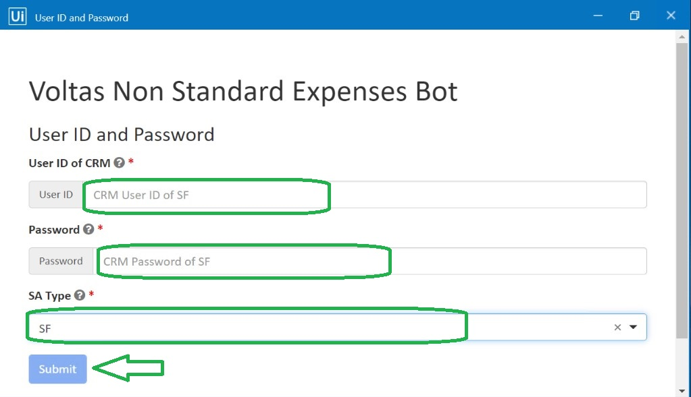

# VoltasNonStandardExpenseEntryBot :robot:

  

## About

VoltasNonStandardExpenseEntryBot is developed using UiPath RE-Framework to automate the data entry
work of Non Standard Expense.

[[Problem and Solution Statements](/Documentation//ProblemAndSolution.md)]

## Usage

#### Create Required Queue, assets in Orchestrator and fill into config File

[[Config File details](/Documentation//Config.md)]

- Clone this project and publish to Orchestrator using UiPath Studio
- Open UiPath Assistant, you will find new process named _VoltasNonStandardExpenseEntryBot_
  
- Open Process and enable PIP Mode , Click RUN.
  
- Wait for process to start.
- A popup form will open, enter CRM credentials and click on submit
  
- Again another popup form will open, now specify excel file path, and excel sheet name
  

- BOT will start Data Entry Process

## License

 

 VoltasNonStandardExpenseEntryBot is distributed in the hope that it will be useful, but WITHOUT ANY WARRANTY, without even the implied warranty of MERCHANTABILITY or FITNESS FOR A PARTICULAR PURPOSE. See the GNU General Public License for more details.

You should have received a copy of the GNU Affero General Public License along with VoltasNonStandardExpenseEntryBot. If not, see https://www.gnu.org/licenses/agpl-3.0.en.html.